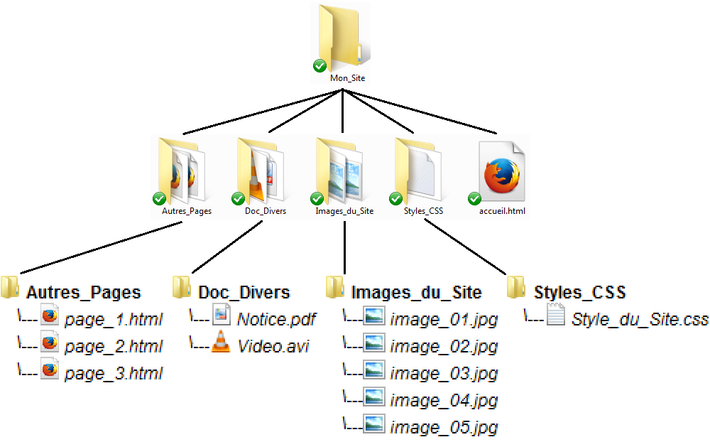
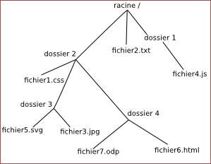
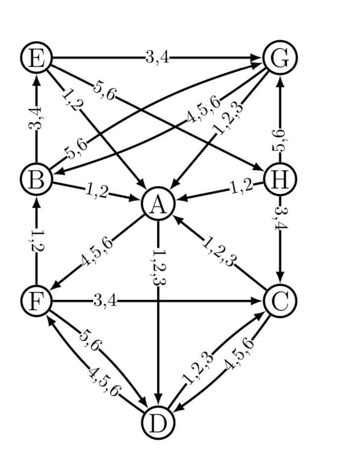

# Thème 1 : Le web 

## Le langage Web : Le HTML

1. Donner la signification de HTML
2. Quel est l'histoire de ce langage ? A quoi servait-il ? 
3. Suivre les leçons de la Khan Academy : https://fr.khanacademy.org/computing/computer-programming/html-css

## Thèmes à aborder 

### Les URL
L'URL ( Uniform Ressource Locator ) indique « l'endroit » où se trouve une ressource sur un ordinateur. 

Dans la barre d'adresse de votre navigateur web vous trouverez, quand vous visitez un site, des choses du genre : "http://www.ac-grenoble.fr/disciplines/informatiquelycee/index.html". 

La partie "http" est le protocole  
La partie "www.ac-grenoble.fr" est l'adresse symbolique (que l'on reverra dans le thème INTERNET)  
La partie "/disciplines/informatiquelycee/index.html" s'appelle une URL, c'est le chemin de la page demandée à partir de la racine du domaine ac-grenoble.fr 

Une URL permet d'identifier une ressource (par exemple un fichier) sur un réseau.  
Un fichier peut se trouver dans un dossier qui peut lui-même se trouver dans un autre dossier... On parle d'une structure en arborescence, car elle ressemble à un arbre à l'envers :  
 

ou schématiser : 

 

### Les cookies 

Une petite vidéo :

https://dai.ly/x16lt53

### Les clients / serveurs 

Deux ordinateurs en réseau peuvent s'échanger des données. Dans la plupart des cas ces échanges ne sont pas "symétriques" : en effet un ordinateur A va souvent se contenter de demander des ressources (fichiers contenant du texte, photos, vidéos, sons...) à un ordinateur B. L'ordinateur B va lui se contenter de fournir des ressources à tous les ordinateurs qui lui en feront la demande. On dira alors que l'ordinateur A (celui qui demande des ressources) est un client alors que l'ordinateur B (celui qui fournit les ressources) sera qualifié de serveur.  

Sur internet, ce modèle client/serveur domine assez largement, même s'il existe des cas où un ordinateur pourra jouer tour à tour le rôle de client et le rôle de serveur (exemple le "peer to peer", voir le module "Internet"), très souvent, des ordinateurs (les clients) passeront leur temps à demander des ressources à d'autres ordinateurs (les serveurs) . Par exemple, comme expliqué dans l'exemple ci-dessus on retrouve cet échange client/serveur à chaque fois que l'on visite une page web. Il y a de fortes chances pour que votre ordinateur personnel joue quasi exclusivement le rôle de client (sauf si vous êtes un adepte du "peer to peer"). 

N'importe quel type d'ordinateur peut jouer le rôle de serveur, mais dans le monde professionnel les serveurs sont des machines spécialisées conçues pour fonctionner 24h sur 24h. Ils peuvent aussi avoir une grosse capacité de stockage afin de stocker un grand nombre de ressources (vidéos, sons,...). 

Afin assurer une continuité de service, dans les sociétés, plusieurs serveurs assurent exactement le même rôle (on parle de redondance). Vous vous doutez bien que Google ne possède pas qu'un seul serveur, en effet, en moyenne, chaque seconde, c'est environ 65000 clients qui se connectent aux serveurs du moteur de recherche de Google. Aucun serveur, même extrêmement performant, ne serait capable de répondre à toutes ces requêtes. Google, Amazon ou encore Facebook possèdent un très grand nombre de serveurs afin de pouvoir satisfaire les demandes des utilisateurs en permanence. Ces entreprises possèdent d'immenses salles contenant chacune des centaines ou des milliers de serveurs (ces serveurs sont rangés dans des armoires appelées "baie serveur").  

 

### Web Statique / web dynamique

1. Donner un exemple de page web statique
2. Donne un exemple de page web dynamique
3. Quelle est l'utilité d'un web dynamique par rapport au statique ?
4. Quel langage permet de rendre la page web dynamique ? 

### RGPD

1. Quelle est la signification du sigle RGPD ?
2. Lister quelques exemples d'utilisation.
3. Quelles sont les conséquences sur internet ?

### Le protocole HTTP 

### Les arnaques sur Internet

### PageRank

Le PageRank est l'algorithme d'analyse des liens concourant au système de classement des pages Web utilisé par le moteur de recherche Google. Il mesure quantitativement la popularité d'une page web. Le PageRank n'est qu'un indicateur parmi d'autres dans l'algorithme qui permet de classer les pages du Web dans les résultats de recherche de Google. Ce système a été inventé par Larry Page, cofondateur de Google. Ce mot est une marque déposée. 

Le principe de base est d'attribuer à chaque page une valeur (ou score) proportionnelle au nombre de fois que passerait par cette page un utilisateur parcourant le graphe du Web en cliquant aléatoirement, sur un des liens apparaissant sur chaque page. Ainsi, une page a un PageRank d'autant plus important qu'est grande la somme des PageRanks des pages qui pointent vers elle (elle comprise, s'il y a des liens internes). Le PageRank est une mesure de centralité sur le réseau du web. 

Plus formellement, le déplacement de l'utilisateur est une marche aléatoire sur le graphe du Web, c'est-à-dire le graphe orienté dont les sommets représentent les pages du Web et les arcs les hyperliens. L'algorithme suppose que l'utilisateur choisisse chaque lien indépendamment des pages précédemment visitées (le réalisme d'une telle hypothèse est discutable). 

#### Activité en groupe

1. créer un programme python simulant un lancé de dé à 6 faces. 
2. Partant de la page A, déplacer vous dans le graphe en suivant le résultat du dé puis noter sur quelle page vous arrivez. 
3. Continuer cette marche jusqu'au signal de l'enseignant .
4. Compléter le tableau pagerank, donnant le nombre de visites sur chaque page.

#### Analyse
1. Compter, pour chaque page, le nombre de liens qui proviennent d'autres pages. 
2. "Plus une page a de liens qui viennent vers elle, plus le PageRank est élevé". En comaparant A, G et H, cette affirmation est-elle correcte. Même question pour A et D. Expliquer cela.  
3. Vous êtes l'auteur de la page H et vous souhaitez augmenter votre PageRank. Par quels moyens artificiels pouvez-vous augmenter ce score ? (vous aurez le droit d'ajouter des liens ou de créer de nouvelles pages).

